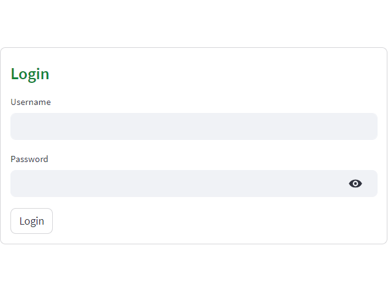
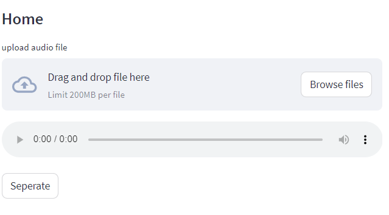
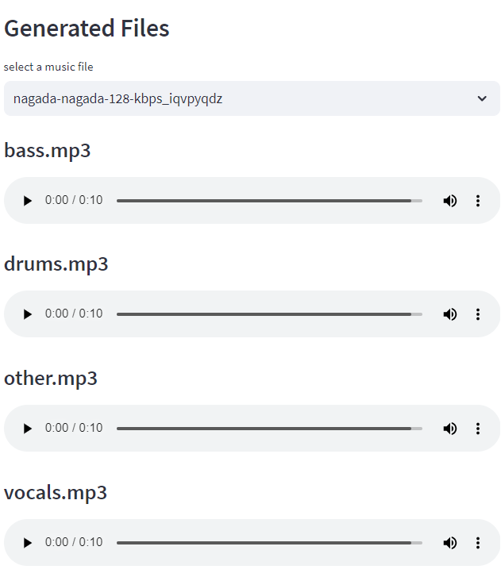

# Music Source Separation web application


Demucs is a state-of-the-art music source separation model, currently capable of separating
drums, bass, and vocals from the rest of the accompaniment.
Demucs is based on a U-Net convolutional architecture inspired by [Wave-U-Net][waveunet].
The v4 version features [Hybrid Transformer Demucs][htdemucs], a hybrid spectrogram/waveform separation model using Transformers.
It is based on [Hybrid Demucs][hybrid_paper] (also provided in this repo) with the innermost layers are
replaced by a cross-domain Transformer Encoder. This Transformer uses self-attention within each domain,
and cross-attention across domains.
The model achieves a SDR of 9.00 dB on the MUSDB HQ test set. Moreover, when using sparse attention
kernels to extend its receptive field and per source fine-tuning, we achieve state-of-the-art 9.20 dB of SDR.


<p align="center">
</p>


### Comparison of accuracy

`Overall SDR` is the mean of the SDR for each of the 4 sources, `MOS Quality` is a rating from 1 to 5
of the naturalness and absence of artifacts given by human listeners (5 = no artifacts), `MOS Contamination`
is a rating from 1 to 5 with 5 being zero contamination by other sources. We refer the reader to our [paper][hybrid_paper],
for more details.

| Model                        | Domain      | Extra data?       | Overall SDR | MOS Quality | MOS Contamination |
|------------------------------|-------------|-------------------|-------------|-------------|-------------------|
| [Wave-U-Net][waveunet]       | waveform    | no                | 3.2         | -           | -                 |
| [Open-Unmix][openunmix]      | spectrogram | no                | 5.3         | -           | -                 |
| [D3Net][d3net]               | spectrogram | no                | 6.0         | -           | -                 |
| [Conv-Tasnet][demucs_v2]     | waveform    | no                | 5.7         | -           |                   |
| [Demucs (v2)][demucs_v2]     | waveform    | no                | 6.3         | 2.37        | 2.36              |
| [ResUNetDecouple+][decouple] | spectrogram | no                | 6.7         | -           | -                 |
| [KUIELAB-MDX-Net][kuielab]   | hybrid      | no                | 7.5         | **2.86**    | 2.55              |
| [Band-Spit RNN][bandsplit]   | spectrogram | no                | **8.2**     | -           | -                 |
| **Hybrid Demucs (v3)**       | hybrid      | no                | 7.7         | **2.83**    | **3.04**          |
| [MMDenseLSTM][mmdenselstm]   | spectrogram | 804 songs         | 6.0         | -           | -                 |
| [D3Net][d3net]               | spectrogram | 1.5k songs        | 6.7         | -           | -                 |
| [Spleeter][spleeter]         | spectrogram | 25k songs         | 5.9         | -           | -                 |
| [Band-Spit RNN][bandsplit]   | spectrogram | 1.7k (mixes only) | **9.0**     | -           | -                 |
| **HT Demucs f.t. (v4)**      | hybrid      | 800 songs         | **9.0**     | -           | -                 |

## This web application have
1.Sign Up and Login page
<p align="center">
</p>
<p align="center">
</p>
2.Music source sepration page with output
<p align="center">
</p>
<p align="center">
</p>


## Requirements

You will need at least Python 3.8. See `requirements_minimal.txt` for requirements for separation only,
and `environment-[cpu|cuda].yml` (or `requirements.txt`) if you want to train a new model.

### For Windows users

Everytime you see `python3`, replace it with `python.exe`. You should always run commands from the
Anaconda console.

### For musicians

If you just want to use Demucs to separate tracks, you can install it with

```bash
python3 -m pip install -U demucs
```


### Memory requirements for GPU acceleration

If you want to use GPU acceleration, you will need at least 3GB of RAM on your GPU for `demucs`. However, about 7GB of RAM will be required if you use the default arguments. Add `--segment SEGMENT` to change size of each split. If you only have 3GB memory, set SEGMENT to 8 (though quality may be worse if this argument is too small). Creating an environment variable `PYTORCH_NO_CUDA_MEMORY_CACHING=1` can help users with even smaller RAM such as 2GB (I separated a track that is 4 minutes but only 1.5GB is used), but this would make the separation slower.

If you do not have enough memory on your GPU, simply add `-d cpu` to the command line to use the CPU. With Demucs, processing time should be roughly equal to 1.5 times the duration of the track.

